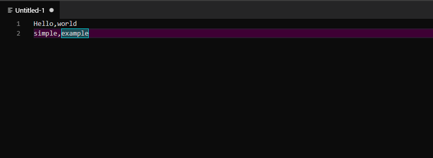
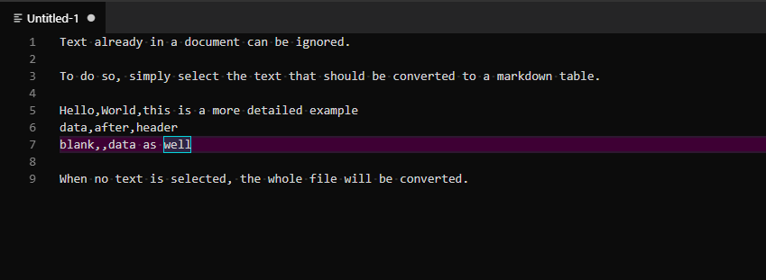

# Markdown from CSV/TSV README

This extension creates a Markdown table from a sequence of lines in the comma delimited value (CSV) or tab delimited value (TSV) format.

The core functionality of this extension utilizes the [CsvToMarkdownTable project](https://github.com/donatj/CsvToMarkdownTable). The source code therein was modified to work cleanly with VS Code.

## How to use

Currently either conversion can be made using either CSV or TSV.

- To convert from CSV to a Markdown table type `CSV to Markdown table` in the command pallet.
- To convert from TSV to a Markdown table type `TSV to Markdown table` in the command pallet.

> Tip: If the desired data to convert is part of a document, select the text to be converted then execute the conversion command.

## Extension Settings

Currently there are no configurable settings.
